2019 年，苹果推出了 SwiftUI，一个全新的基于 Swift 语言的声明式 UI 框架。它让写一个 iOS 原生 app 变得空前简单。不过有些遗憾的是，在一年后的今天，网上仍然没有比较系统的 SwiftUI 中文教程，甚至外网的资料也是零零散散，看着直叫人凌乱...那么我们不妨从头来过，从 wwdc2019 的 SwiftUI 系列视频开始学起，看官方的教程，走最正的路~

今天我们学习的是 [Introducing SwiftUI: Building Your First App](https://developer.apple.com/videos/play/wwdc2019/204/)，也就是用 SwiftUI 做第一个 app。访问官方视频卡顿的同学也可以看b站up [搬运的版本](https://www.bilibili.com/video/bv1T4411q7Du)。

在开始我们的学习之前，因为 iOS 开发只能在 macOS 上进行，你需要有一个 mac，并且请安装Xcode（通过 app store 安装就好啦）。不同 Xcode 版本的界面和提供的功能可能有些许不同，我的 Xcode 版本是 12.3，macOS 11.0 Big Sur。

## 创建项目

在写代码之前，先要在 Xcode 中新建一个 SwiftUI 项目。用于打开Xcode，点击 Create a new Xcode project 创建新项目。


在 Multiplatform 中选择 iOS 平台， Application 选项中选择 App，并点击 Next。

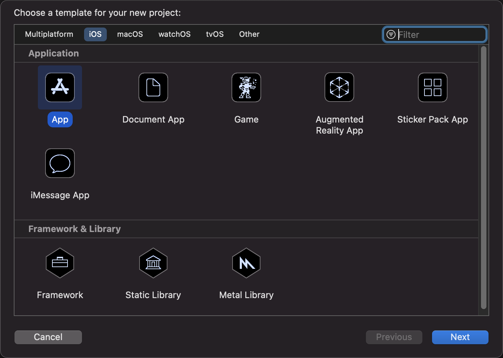

为你的项目起个名字，这次因为我们要做的是一个记录会议室信息的 app，所以我们把它起名为 Room。注意下面的 Interface 要选择 SwiftUI。再点击 Next。

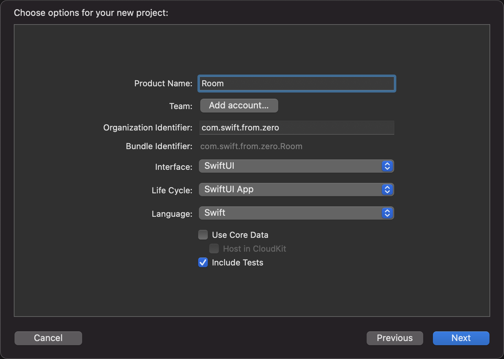

选择你要存储这个项目的地址，并点击 Create ，就会自动创建我们的项目了。

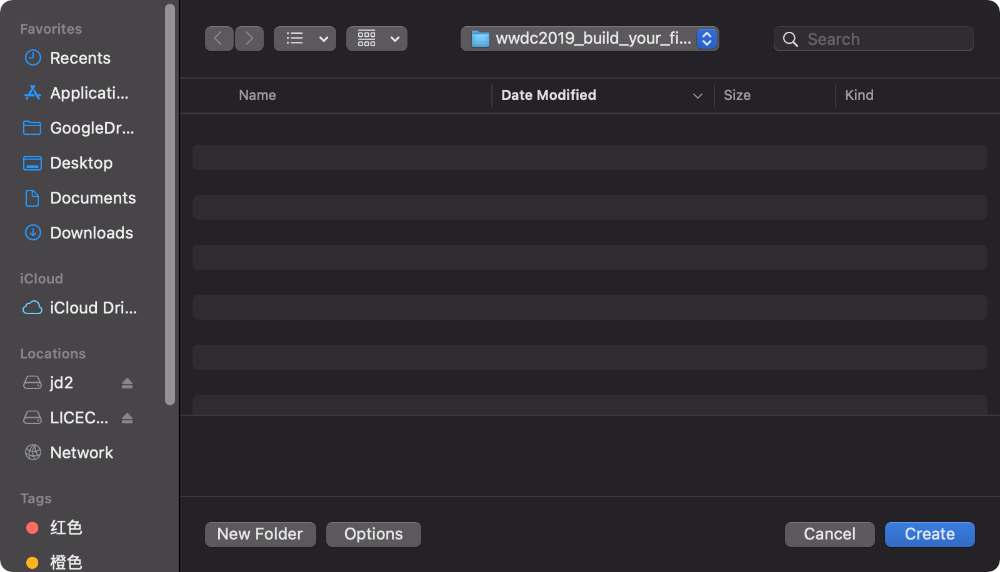

稍等片刻，Xcode 就会自动为我们创建出一个 SwiftUI 项目的模板，界面也会跳转至这样：

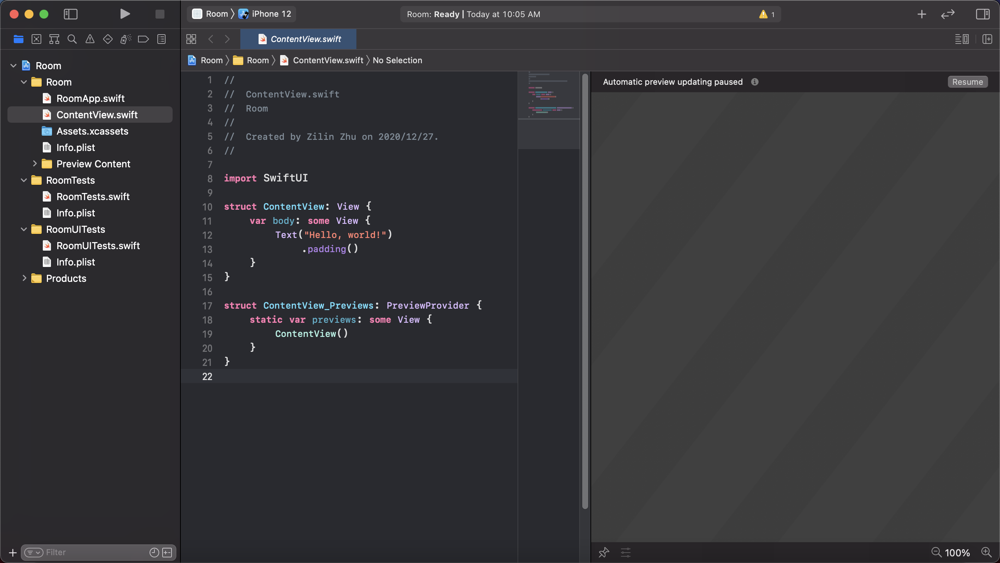

点击右上的 Resume，你就可以在右侧预览初始的界面了！也就是正中央的一个 “Hello world”。

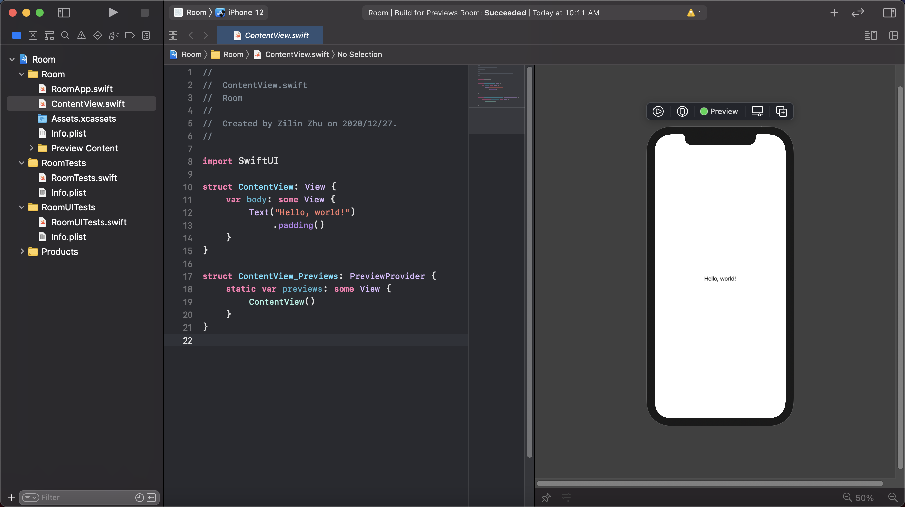

至此，我们的项目就创建好了！

## SwiftUI 初体验

上面的示例代码中， SwiftUI 默认给我们添加了一个 `.padding()`，等后面我们再介绍它是干什么用的，现在先把它删掉，然后因为我们是一个介绍会议室的 app 嘛，所以把 `Text("Hello world!")` 改成 `Text("Rooms")`。修改代码之后，你会发现右侧的预览界面自动跟着变化了。

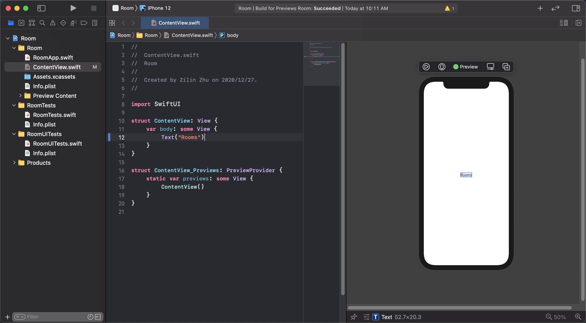

在 Room 外的蓝框是因为代码中光标停留在了 `Text("Rooms")`，预览在自动提示你这个 `Text` 对应的是屏幕上的哪一部分。

下一步，我们要开始在页面上添加内容了。点击右上角的 "+"，选择 Text，点击并拖拽到预览中的 Rooms 文字下方。注意在拖拽到 Rooms 附近的时候，Xcode 会根据相对位置在预览下方做出提示。完成拖拽后，稍等片刻，预览中就在 Rooms 下方出现了 Placeholder 字样。就这样，我们就很轻松地在页面上添加了一个文字组件。

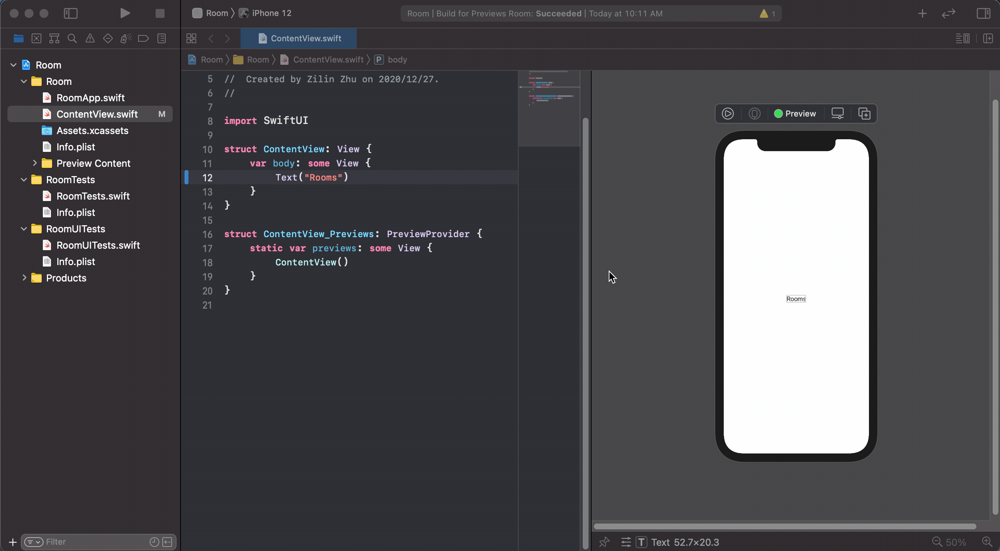

除了右侧的预览产生了变化，你会发现左侧的代码也随之变化为了：

```swift
struct ContentView: View {
    var body: some View {
        VStack {
            Text("Rooms")
            Text("Placeholder")
        }
    }
}
```

到这里你应该也能猜出来，这个 `struct ContentView` 就是生成右侧视图的代码了。SwiftUI 中的每个组件都是一个 `View`（视图），所以在后面我们就把 `Text` 这样的东西称之为视图了。上面的操作中，Xcode 自动添加了一个 `Text` 视图，并把两者放在了一个 `VStack` 视图中。`VStack` 也就是 vertical stack，会自动垂直摆放其中的子视图。类似的也有 `HStack`，会水平摆放视图。

接下来，我们把 `"Placeholder"` 改为 `"20 people"`，表示这个会议室能容纳20人。然后我们希望在这两行文字左边插入一张会议室的图片。按住 command 并点击 `VStack`，在弹出的选项栏中选择 Embed in HStack，从而在 `VStack` 外面插入一个 `HStack`。然后在 `VStack` 前面插入一个 `Image` 视图，这里我们暂时使用系统自带的图片 `Image(systemName: "photo")`。稍等片刻，就可以看到一个图标出现在了之前的两行文字的左边。

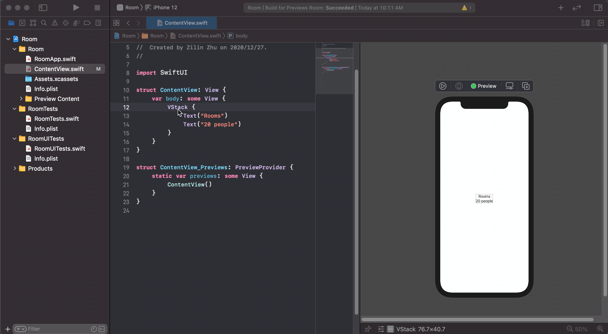

下面，我们希望稍微调整一下我们的视图的外观样式。这点也可以在右侧的预览中直接实现。选中 `VStack`（可以在预览中选中，或者通过左侧的代码选中），按住 command 并点击预览中的蓝框，在选项栏中选择 Show SwiftUI Inspector。这个时候界面会弹出 `VStack` 的 Inspector，里面可以调整 `VStack` 的样式。调整上面的 Alignment 为左对齐（在 SwiftUI 中，称为 leading 对齐，这是为了更好地适应阿拉伯语这样从从右至左的界面），你会发现预览和左边的代码都随着你的选择而变化了。

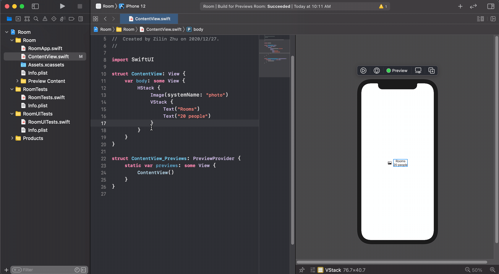

类似的，我们可以修改文字的样式。这次我们把 20 people 这行文字的大小改为 subheadline。


通过对比代码变化，相比你也能看出该如何在 SwiftUI 代码中更改视图样式。让我们改变一下 `"20 people"` 这行字的颜色。方法就是在上面一步添加的 `.fond(.subheadline)` 下面，添加一行 `".foregroundColor(.secondary)"`。

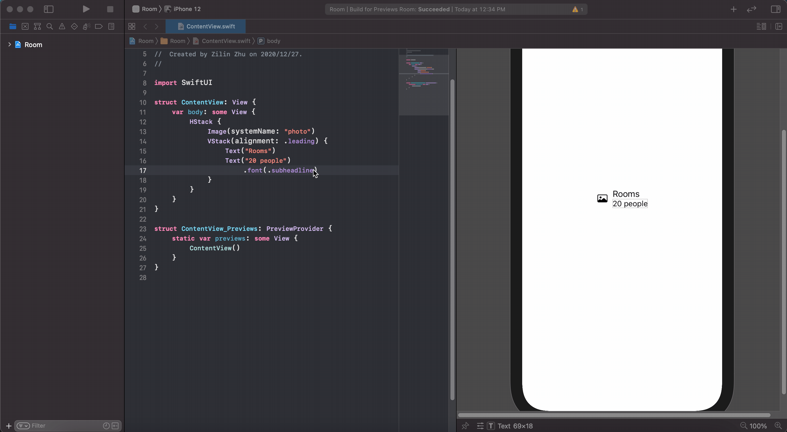

至此，我们的 `ControlView` 已经变成了：

```swift
struct ContentView: View {
    var body: some View {
        HStack {
            Image(systemName: "photo")
            VStack(alignment: .leading) {          // VStack 的对齐样式
                Text("Rooms")
                Text("20 people")
                    .font(.subheadline)           // Text 文字大小
                    .foregroundColor(.secondary)  // Text 颜色
            }
        }
    }
}
```

我们也就有了表示一个会议室的视图。不过显然我们的办公楼不可能只有一个办公室，所以我们需要的是一个会议室的列表。对此 Xcode 也提供了一个很棒的功能。

按住 command 点击 `HStack`（注意，这个 command + 鼠标左键 的操作在预览窗口，还是代码上都可以做），选择 Embed in List。

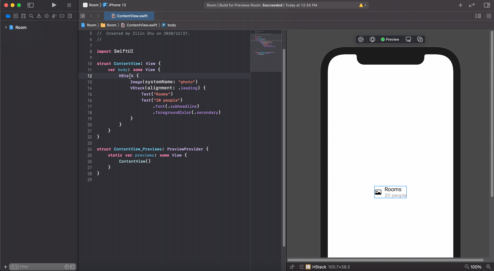

Xcode 就会自动制作一个包含5个我们的视图的列表了！

到这里你是不是已经对 SwiftUI 的方便简洁有所感受了呢？因为篇幅所限，我们会在下一篇中再来研究如何把这里面的硬编码的值换成我们的自定义的数据，并插入漂亮的图片，敬请期待！