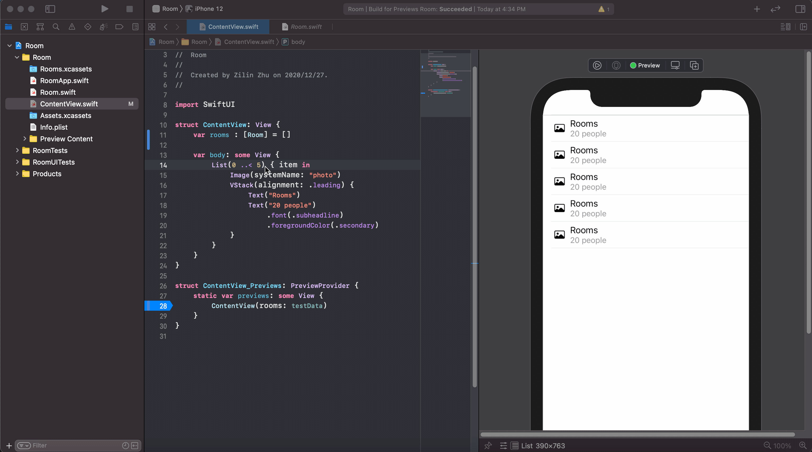
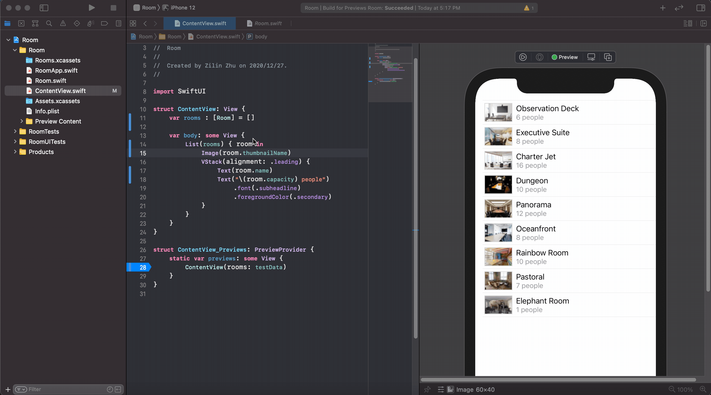
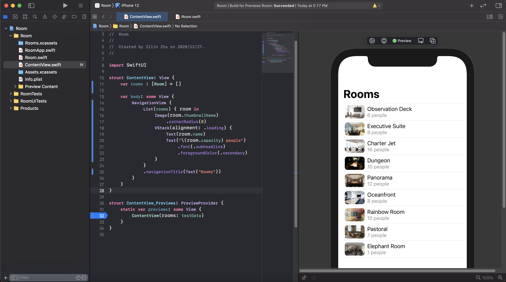
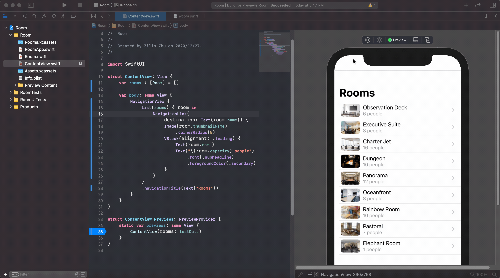
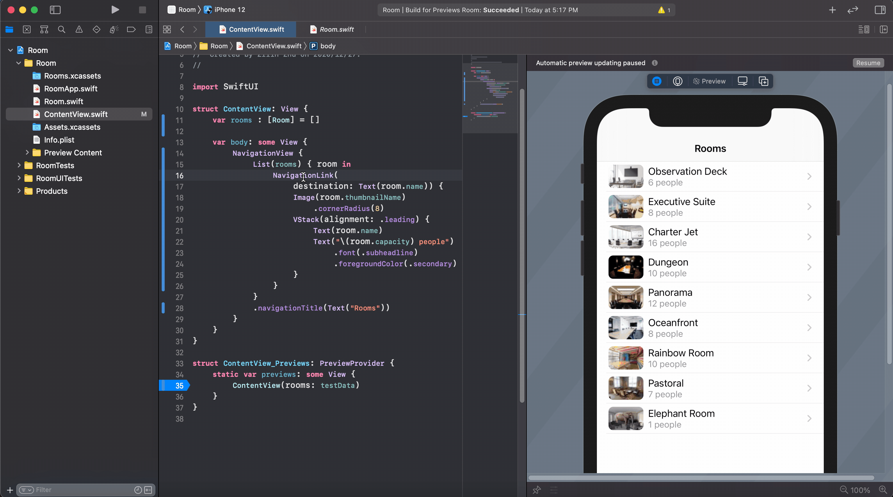

# 从wwdc2019学SwiftUI——搭建你的第一个 SwiftUI 应用 (2)

让我们继续跟着 wwdc2019 的 [Introducing SwiftUI: Building Your First App](https://developer.apple.com/videos/play/wwdc2019/204/) 来学习使用 SwiftUI。

## 下载项目

上一篇教程的最后提到，这次我们要引入自定义的数据和图片，我把这些数据和图片都已经保存在了 [swiftui-from-zero/wwdc2019_building_your_first_app](https://github.com/swiftui-from-zero/wwdc2019_building_your_first_app) 这个 github 项目中，请你把代码下载下来，边看边看变动手，跟着我一起继续我们的教程。下载需要的指令如下：

```bash
git clone https://github.com/swiftui-from-zero/wwdc2019_building_your_first_app.git
cd wwdc2019_building_your_first_app
git checkout startup
```

下载完成后，请用 Xcode 打开 `wwdc2019_building_your_first_app/Room/Room.xcodeproj`，从而打开我们的会议室项目。

现在这版项目和我们在上一篇教程的结尾相比，只是加入了 `Rooms.xcassets` 这个包含了我们之后会用到的图片的文件夹，以及 `Room.swift` 。`Room.swift` 主要包含了一个用来描述会议室的结构体 `Room` 和一些测试数据。

```swift
struct Room: Identifiable {
    var id = UUID()
    var name : String
    var capacity : Int
    var hasVideo : Bool = false
    
    var imageName : String {return name}
    var thumbnailName : String {return name + "Thumb"}
}
```

注意，为了让 SwiftUI 的 `List` 能使用这个自定义的结构体，`Room` 需要符合 `Identifiable` 协议，并实现一个 `var id` 作为其唯一标识符。实现了 `id` 后，`List` 就能定位成员的变化了。

## 传入并展示数据

打开项目后，如果界面没有显示 ContentView.swift 的界面，你只需要点击左侧文件列表中的 ContentView.swift 就行了。Xcode 自动为我们生成了很多的文件以及文件夹，在这个系列教程中，我们只需要考虑 Room 文件夹中的几个 `.swift` 文件就好了。

恢复界面后，我们来把数据导入视图。在 `ContentView` 中，添加一个成员变量——一个用于存储会议室信息的 `Room` 数组：

```swift
struct ContentView: View {
    var rooms : [Room] = []

    var body: some View {
        ...
    }
}
```

并在负责预览的代码里（也就是 `ContentView.swift` 除去 `struct ContentView` 的那部分），用 `Room.swift` 中的测试数据初始化视图。SwiftUI 很方便的一点就是预览会随代码的变化动态调整，从而让我们可以在写代码的过程中方便地实时查看预览。

```swift
struct ContentView_Previews: PreviewProvider {
    static var previews: some View {
        // 这里之前应该是 ContentView()
        ContentView(rooms: testData)
    }
}
```

这样，我们就顺利的把数据传给了视图，那么下一步自然就是要可视化这些数据了，也就是显示一个会议室的列表。我们需要把 `List` 的输入从 `0 ..< 5` 改成 `rooms`，从而把每个会议室的信息传给列表的每个节点。其次，把之前硬编码的 `"Rooms"` 和 `"20 people"`  分别改成会议室的名称和能容纳的人数。最后，再把图片改成房间的缩略图（`room.thumbnailName` 表示了图片缩略图的名字，Xcode 会根据名字自动地从我预先加入的图片中选取我们想要的图标）。在下面的动图中，你可以很清楚的看到预览是如何动态地随左侧代码变化的。



经过上述改动后， `ContentView` 的代码变为：

```swift
struct ContentView: View {
    var rooms : [Room] = []

    var body: some View {
        List(rooms) { room in
            Image(room.thumbnailName)
            VStack(alignment: .leading) {
                Text(room.name)
                Text("\(room.capacity) people")
                    .font(.subheadline)
                    .foregroundColor(.secondary)
            }
        }
    }
}
```

下一步，我们想为图片加个圆角。没错，加圆角的方式和上一篇文章中的 `.foregroundColor(.secondary)` 类似，都是在视图的后面调用一个方法，这类方法在 SwiftUI 中都被称为 modifier。除了直接添加代码，这里我们展示一下如何用拖拽的方式添加 modifier。

点击右上角的 “+”，选择 Modifers，并搜索 Corner Radius。拖拽这个 modifier 至预览的图像上，设定需要的圆角半径，就完成了。



## 实现跳转功能

至此我们已经有了一个漂亮的会议室列表，不过能展示的内容有限，而且图片太小了，不方便查看。所以我们希望点击一个会议室就能显示它的详细信息。为了实现这个功能，我们需要先实现一个跳转功能。

首先，要在 `List` 视图之外包一层 `NavigationView`。然后在 `List` 后添加 `.navigationTitle(Text("Rooms"))` 作为当前导航页的标题。



然后在 `List` 的成员中添加一个 `NavigationLink` 视图，这个视图需要 2 个输入，第一个是跳转后的目标视图，第二个则是当前的视图。为了简单起见，我们暂时把跳转后的视图设置为一个显示会议室的名字的 `Text`，所以第一个输入为 `destination: Text(room.name)`。第二个参数则是之前的每个会议室的列表格子。


到这里我们的跳转功能就完成了。不过该怎么查看效果呢？可以点击预览界面上的运行按钮（圆形中有一个三角形的那个），进入实时预览模式，在这个模式下，我们就可以通过点击会议室的格子，看到跳转的效果了。



上图我们可以看到， SwiftUI 自动生成了转换的动画。不止如此，如果我们缓慢的切换页面，可以看到 SwiftUI 自动高亮了选中的部分，并且在切换过程中对视图的各部分进行了渐变、放缩和变色等处理，让整个过程非常自然。要知道我们可是没有写任何动画相关的代码！这就是 SwiftUI 的一大优势，框架本身会自动为用户生成符合 iOS 使用习惯的动画。


## 提取子视图

添加了跳转功能之后，`ContentView` 视图变得有些复杂了，这个时候我们就需要考虑要对视图进行抽象。我们不妨尝试把 `List` 中的单元抽离出来。Xcode 提供了非常方便的抽象工具。按住 command 点击 `NavigationLink` ，选择 Extract Subview，Xcode 就会自动把它转化为一个子视图 `ExtractedView`，还可以直接进行重命名，这里我们命名为 `RoomCell`。



`RoomCell` 中还没有 `room` 变量，所以会发现报错了，需要我们简单修改代码，补上 `room` 这个成员变量。修改后， `ContentView.swift` 变成了：

```swift
// ...

struct ContentView: View {
    var rooms : [Room] = []

    var body: some View {
        NavigationView {
            List(rooms) { room in
                RoomCell(room: room)  // 传入 room
            }
            .navigationTitle(Text("Rooms"))
        }
    }
}

// ...

struct RoomCell: View {
    let room : Room  // 创建一个 room 变量
    
    var body: some View {
        NavigationLink(
            ...
        }
    }
}
```

这时，我们的视图就又可以正常预览显示了。

由于篇幅所限，本文要告一段落了。本篇教程中，我们学习了如何在 SwiftUI 视图中展示数据，如何实现页面跳转以及如何提取子视图。在下一篇教程中，我们会开始制作一个漂亮的详细信息页面，并学习如何通过用户输入来改变视图，敬请期待！
