# 从 wwdc 学 SwiftUI——搭建你的第一个 SwiftUI 应用 (3)

让我们继续跟着 wwdc2019 的 [Introducing SwiftUI: Building Your First App](https://developer.apple.com/videos/play/wwdc2019/204/) 来学习使用 SwiftUI。

## 下载项目

本次初始的代码和 (2) 结束时的状态是一样的。如果你没有保存当时的代码，可以通过下面的方法下载：

```bash
git clone https://github.com/swiftui-from-zero/wwdc2019_building_your_first_app.git
cd wwdc2019_building_your_first_app
git checkout before-new-view
```

并用 Xcode 打开 `wwdc2019_building_your_first_app/Room/Room.xcodeproj`。

还是要提醒大家，跟着教程一起写代码学习效率更高哦！

## 创建新视图

在 Xcode 中新建一个 swift 文件，用于展示会议室的详细信息。在 Xcode 的导航栏中点击 File -> New -> File...，选择 User Interface 中的 SwiftUI View 作为模板

<p align="center">
    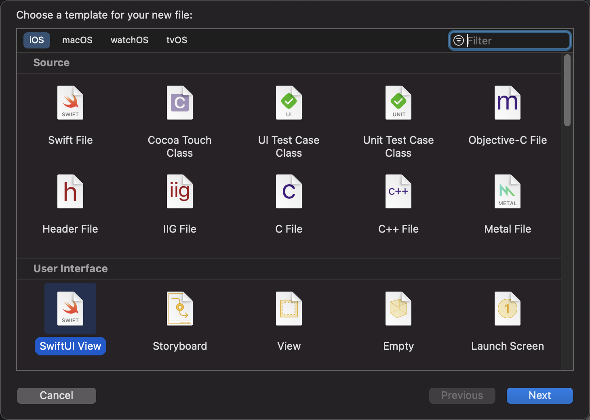
</p>

并命名为 RoomDetail。这样 Xcode 就会创建一个名为 RoomDetail.swift 的文件，其中包含了 SwiftUI 视图以及预览的初始模板：

```swift
import SwiftUI

struct RoomDetail: View {
    var body: some View {
        Text("Hello, World!")
    }
}

struct RoomDetail_Previews: PreviewProvider {
    static var previews: some View {
        RoomDetail()
    }
}
```

## 搭建 RoomDetail UI

和上一讲的最后提取出来的 `RoomCell` 一样，为了展示会议室，`RoomDetail` 也需要一个 `Room` 类型的成员变量。在添加了这个成员之后，我们也需要修改预览部分的代码，用 `testData[0]` 来初始化 `RoomDetail` 以让预览视图能正确生成。

```swift
import SwiftUI

struct RoomDetail: View {
    let room: Room  // 添加 room 变量
    
    var body: some View {
        Text("Hello, World!")
    }
}

struct RoomDetail_Previews: PreviewProvider {
    static var previews: some View {
        RoomDetail(room: testData[0])   // 别忘了修改 preview 哦
    }
}
```

下一步，让我们开始设计这个新视图的 UI。

我们打算在这个视图中展示会议室的图片，所以先把图片插入进去。

```swift
struct RoomDetail: View {
    let room: Room
    
    var body: some View {
        Image(room.imageName)
    }
}
```

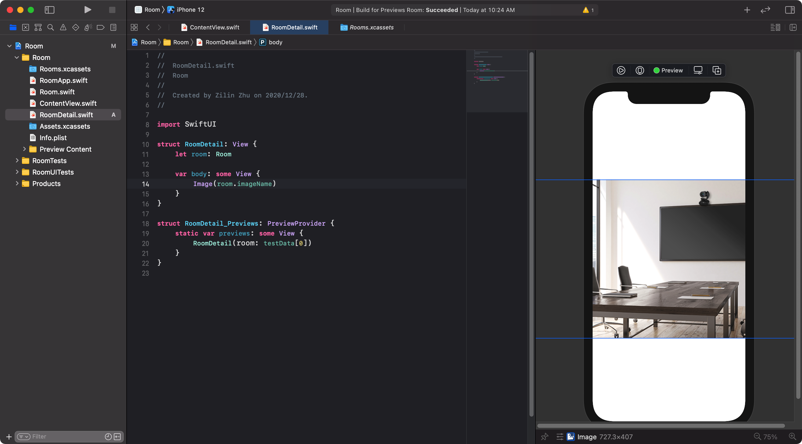

可以看到预览中的图片范围是超过了屏幕范围的。SwiftUI 默认会使用图像的原尺寸，如果想改变图像的尺寸的话，需要使用 `.resizable()` 这个 modifier。

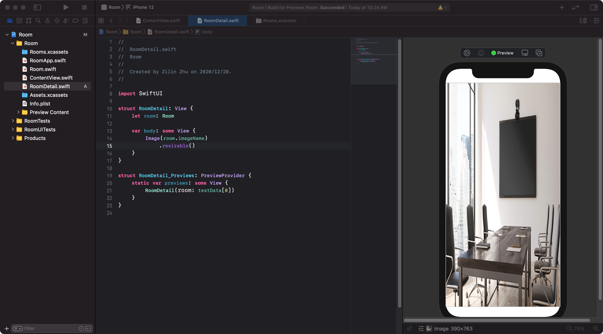

添加了 `.resizable()` 之后，可以看到图片会根据屏幕的尺寸进行变形放缩。但是这样生硬的变形显然是不太美观的，如果要保持图片原有的长宽比，就需要 `aspectRatio` 这个 modifier 了。`aspectRatio` 有一个 `contentMode` 参数，可以传入 `.fill` 或 `.fit` ，前者会让图片占据整个空间，后者则会根据图片比例，把整张图放进来。为了能更好的查看图片，让我们暂时使用 `.fit`。

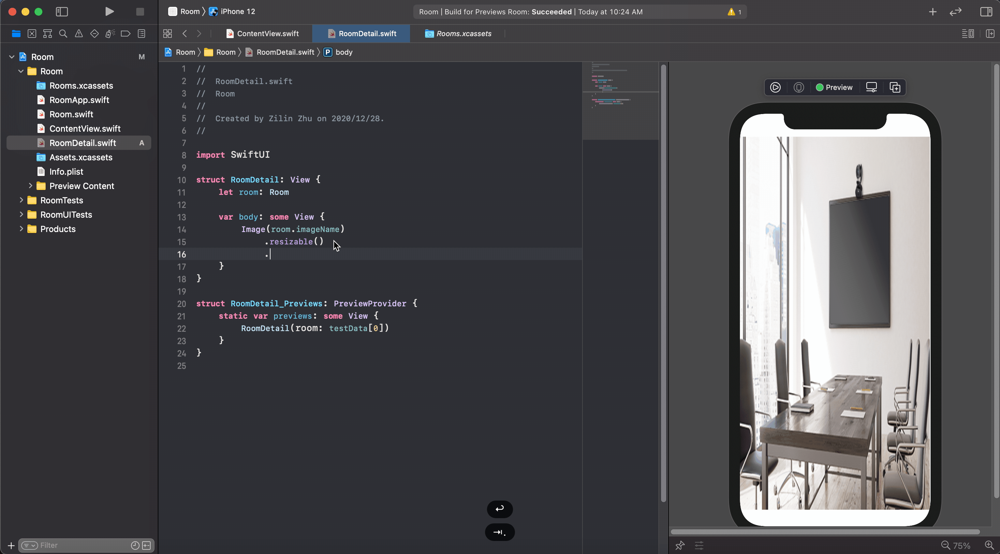

现在，我们可以回到 `ContentView` 中，把导航栏指向的 View 从 `Text` 改为 `RoomDetail` 了。这样在 `ContentView` 的预览中点击格子，就可以跳转到我们制作的 `RoomDetail` 页面了。

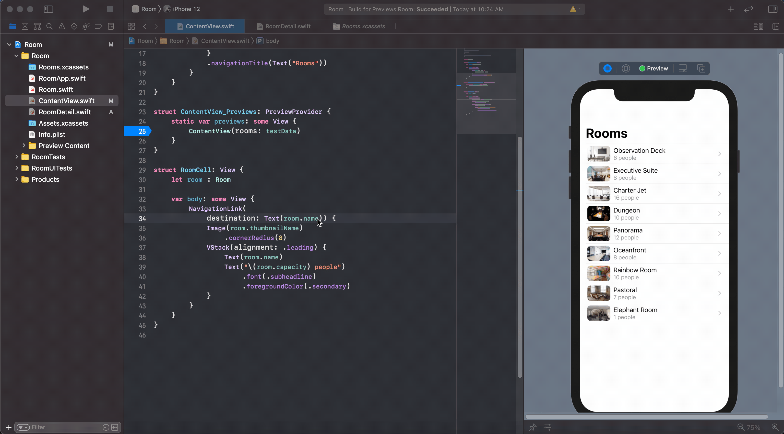

接下来我们给 `RoomDetail` 页面加一个导航栏标题，为了不让这个标题太大，设置了 `displayMode: .inline`。

```swift
struct RoomDetail: View {
    let room: Room
    
    var body: some View {
        Image(room.imageName)
            .resizable()
            .aspectRatio(contentMode: .fit)
            .navigationBarTitle(Text(room.name), displayMode: .inline)  // 添加导航栏标题
    }
}
```

不过，这个时候的预览并不会显示这个我们新添加的标题，因为预览部分的 `RoomDetail` 不在导航栏中。我们可以通过简单修改预览代码来更好得查看我们的视图——用 `NavigationView` 包住预览中的 `RoomDetail`：

```swift
struct RoomDetail_Previews: PreviewProvider {
    static var previews: some View {
        NavigationView { RoomDetail(room: testData[0]) }
    }
}
```

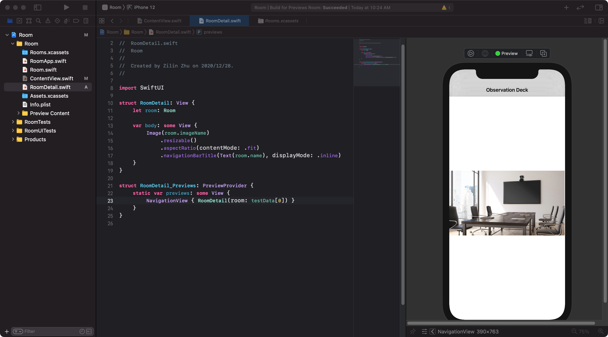

## 根据用户输入改变视图

我们的用户突然发来了一个奇特的需求，他们特别在意会议室的桌子的质量，所以需要能放大页面中的图片，便于他们更清楚地端详房间里的桌子。对于这种奇怪的需求，我们的解决方案是让用户可以通过点击放大图片，在代码中的体现就是从 `.aspectRatio(contentMode: .fit)` 变为 `.aspectRatio(contentMode: .fill)`。

那么如何实现这个转化呢？一个很自然的思路就是给 `RoomDetail` 加上一个 `zoomed` 变量来控制图片是否放大。并在图片外面加一个 `onTapGesture`  modifier，使用户在每次点击时都可以调整 `zoomed` 的值。

```swift
struct RoomDetail: View {
    let room: Room
    var zoomed: Bool = false

    var body: some View {
        Image(room.imageName)
            .resizable()
            .aspectRatio(contentMode: zoomed ? .fill : .fit)
            .navigationBarTitle(Text(room.name), displayMode: .inline)
            .onTapGesture {
                zoomed.toggle()
            }
    }
}
```

然而上述的代码却触发了错误：


错误中说："Cannot use mutating member on immutable value: 'self' is immutable"。也就是说 `RoomDetail` 视图本身是不可变的值。SwiftUI 内部的数据模型要求视图是不可变的，如果需要修改成员变量，则需要在变量前面加上 `@State` 这个 property wrapper。也就是：

```swift
struct RoomDetail: View {
    let room: Room
    @State private var zoomed: Bool = false  // 这里的 private 可以不加

    var body: some View {
        Image(room.imageName)
            .resizable()
            .aspectRatio(contentMode: zoomed ? .fill : .fit)
            .navigationBarTitle(Text(room.name), displayMode: .inline)
            .onTapGesture {
                zoomed.toggle()
            }
    }
}
```

这时，在预览中点击图片，就可以看到图片随点击变化了。

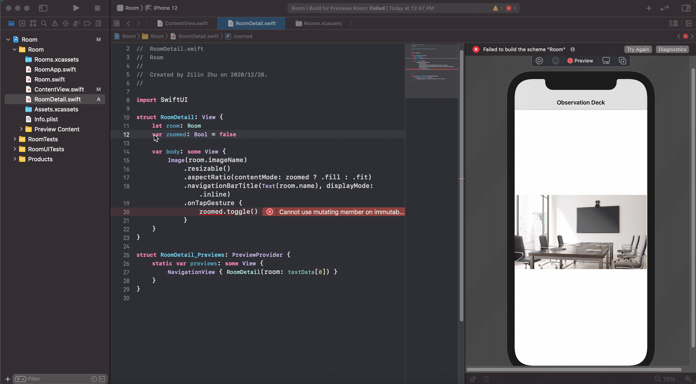

SwiftUI 的数据模型让你不再需要考虑各式各样的回调函数的先后顺序以及互相影响，从而更好的专注于 UI 交互。我们会在之后的教程中详细介绍它。现在你只要记住如果需要在视图内调整成员变量的值，就要在变量前面加 `@State` 就好了。

## 加入动画

现在的这个切换显得有些生硬，让我们来加入动画进行过渡吧。加入动画的方式无比简单，只需要在 `zoomed.toggle()` 外面套一层 `withAnimation {}` 即可：

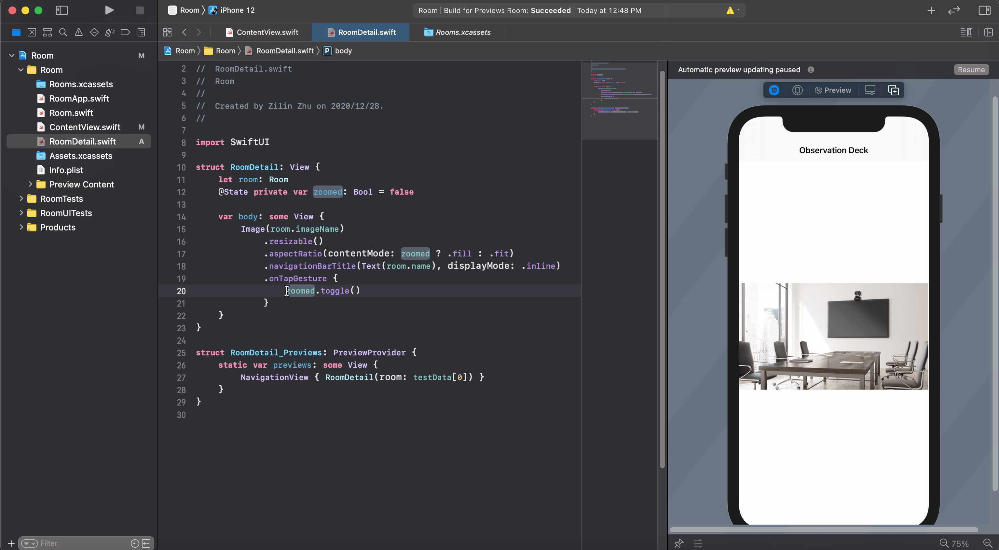

是不是很简单！SwiftUI 会根据视图变化，自动添加合理的动画，在我们的例子中也就是连续的放缩了。并且这个动画可以在中间打断，我们可以在放大到一半的时候再次点击让他缩小下来。

## 叠加新元素

用户的另一个需求是显示会议室是否具有视频会议功能。所以我们打算在 `RoomDetail` 视图中为可以进行视频会议的会议室添加一个摄像头图标。我们使用 `ZStack` 来叠放不同的视图（摄像头图标和会议室图片），并选择使用 SF Symbol 中的 `video.fill` 作为摄像头图标，并用 `.font` 来改变其大小（这是 SF Symbol 图片，也就是用 `systemName` 指定的图片，独特的变换大小的方法）。之后，我们设置 `ZStack` 为 `alignment: .topLeading` 从而把摄像头图标移到左上角。最后，我们给这个图标加上 padding。调整后的 `RoomDetail` 为：

```swift
struct RoomDetail: View {
    let room: Room
    @State private var zoomed: Bool = false

    var body: some View {
        ZStack(alignment: .topLeading) {  // 左上角对齐
            Image(room.imageName)
                ...

            Image(systemName: "video.fill")  // 摄像头图标
                .font(.title)  // 调整图标大小
          	    .padding()  // padding
        }
        
    }
}
```


这个时候，摄像头的位置在会议室图片的左上角。我们希望把它摆在整个视图的左上角。这里有一个小技巧，要在 `Image` 后面的加一个 `.frame` modifier 调整 `Image` 视图占据的空间。这里我们设置让图片占据全部的空间，从而让 `topLeading` 对齐变成了在屏幕的左上角对齐。

```swift
struct RoomDetail: View {
    ...

    var body: some View {
        ZStack(alignment: .topLeading) {
            Image(room.imageName)
                ...
                .frame(minWidth: 0, maxWidth: .infinity, minHeight: 0, maxHeight: .infinity)

            Image(systemName: "video.fill")
                ...
        }
        
    }
}
```

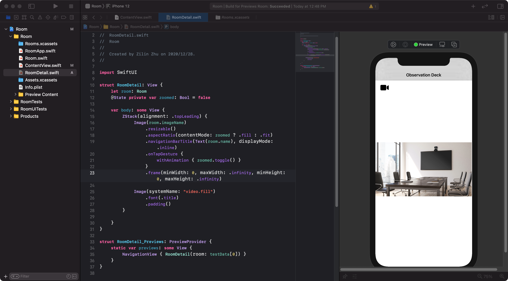 

我们会在后面的教程中再详细介绍 SwiftUI 的布局。现在你只要记住这个小技巧就好了。

下一步，我们希望在只有在支持视频会议的会议室的页面显示摄像头图标。因为 SwiftUI 是声明式编程，只需要在 `body` 中添加条件语句就好了。

```swift
struct RoomDetail: View {
    ...

    var body: some View {
        ZStack(alignment: .topLeading) {
            Image(room.imageName)
                ...

            if room.hasVideo {
                Image(systemName: "video.fill")
                    ...
            }
        }
        
    }
}
```

## 创建多个预览

在上面的页面加入判断之后，我们希望能检查一下不支持视频会议的房间页面上的摄像头图标是不是已经被去掉了。有一个很简单的方法可以做到这点，就是把预览中的初始化数据从 `RoomDetail(room: testData[0])` 改为 `RoomDetail(room: testData[1])`。因为在我们的测试数据中，第一个房间支持视频会议，第二个不支持，所以更改后的预览视图里面就不应该有摄像头图标了。不过，如果我们后续需要继续修改摄像头图标的样式，就又得把预览代码改回来，很不方便。

那么有没有什么方法能同时显示 2 个预览视图，一个支持视频会议，一个不支持呢？可以按住 command 点击预览代码中的 `NavigationView`，选择 Group，这时就会出现一个 `Group` 视图包裹 `NavigationView`。 `Group` 视图中是可以设置多个预览视图的。例如：

```swift
struct RoomDetail_Previews: PreviewProvider {
    static var previews: some View {
        Group {
            NavigationView { RoomDetail(room: testData[0]) }
            NavigationView { RoomDetail(room: testData[1]) }
        }
    }
}
```

设置好之后，就可以在右侧看到 2 个预览视图了。

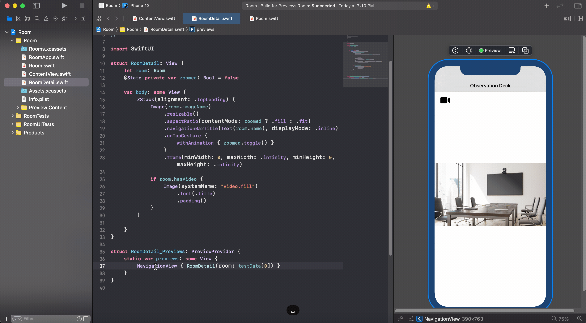

## 自定义动画

我们继续回来美化我们的页面。现在不管放大还是缩小，都会显示摄像头图标。为了用户更好地看清大图，我们可以设置在放大图片的时候不显示这个图标。这一点只需要在图标图片外的判断语句中多加一个判断就行了。

```swift
struct RoomDetail: View {
    ...

    var body: some View {
        ZStack(alignment: .topLeading) {
            ...

            if room.hasVideo && !zoomed {  // 添加了 && !zoomed
                Image(systemName: "video.fill")
                    .font(.title)
                    .padding()
            }
        }
        
    }
}
```

这个时候，点击图片我们会发现，SwiftUI 也自动地为摄像头的消失和再现做了动画。默认的动画是渐进和渐出。

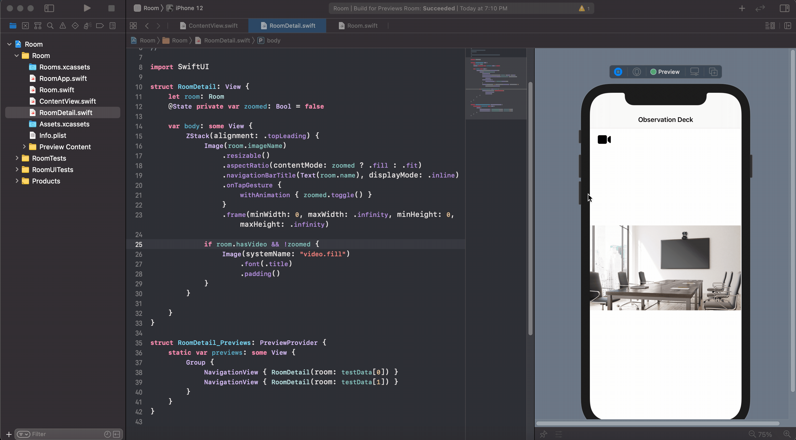

我们希望把这个动画改一下，这就要用到 `.transition` 这个 modifier 了。这一次我们为图标设置了 `.transition(.move(.leading))`，表示图标会从 leading 边（默认是左边）滑入滑出。为了更好地看清动画，我们在 `withAnimation` 上设置了动画运行的时间。修改后的代码变为：

```swift
struct RoomDetail: View {
    ...

    var body: some View {
        ZStack(alignment: .topLeading) {
            Image(room.imageName)
                ....
                .onTapGesture {
                    // 修改动画时间为 1s，使用默认的线性变化
                    withAnimation(.linear(duration: 1)) { zoomed.toggle() }
                }
                ....

            if room.hasVideo && !zoomed {
                Image(systemName: "video.fill")
                    ....
                    .transition(.move(edge: .leading))
            }
        }
    }
}
```

修改后的动画如下：


至此我们就完成了 `RoomDetail` 页面。

由于篇幅所限，本文要告一段落了。在本篇教程中，我们学习了如何创建新视图，如何根据用户输入调节视图，如何创建多个预览视图，以及如何自定义动画。不过截止到现在，我们还是使用的固定的 `testData`，下一篇教程讲教你该如何增删会议室列表的内容，敬请期待！
