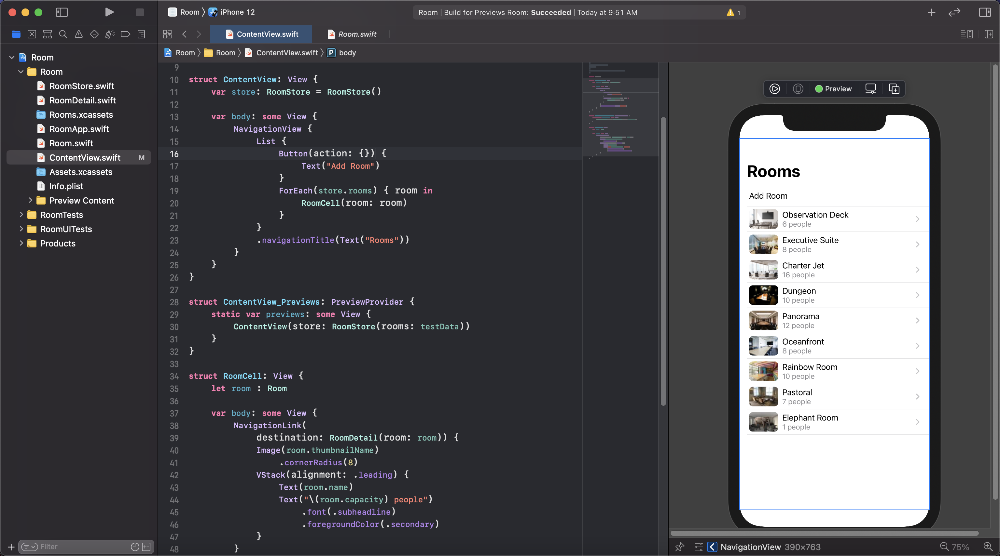
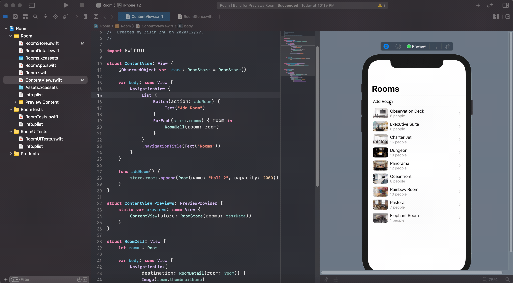
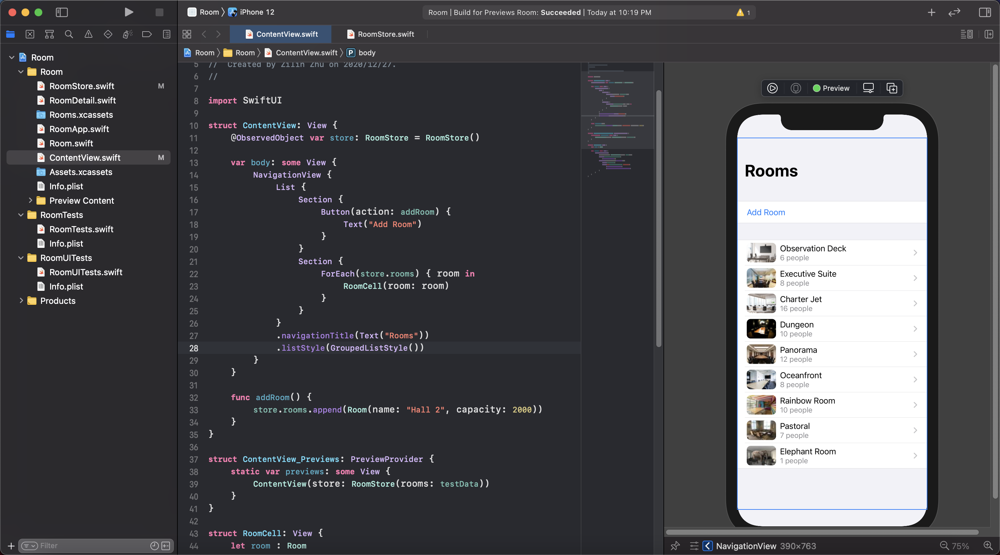
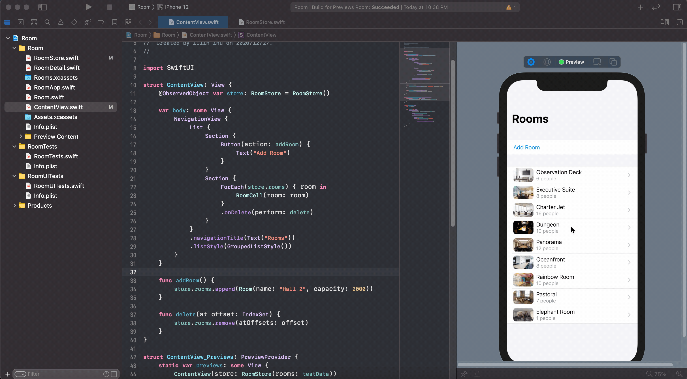
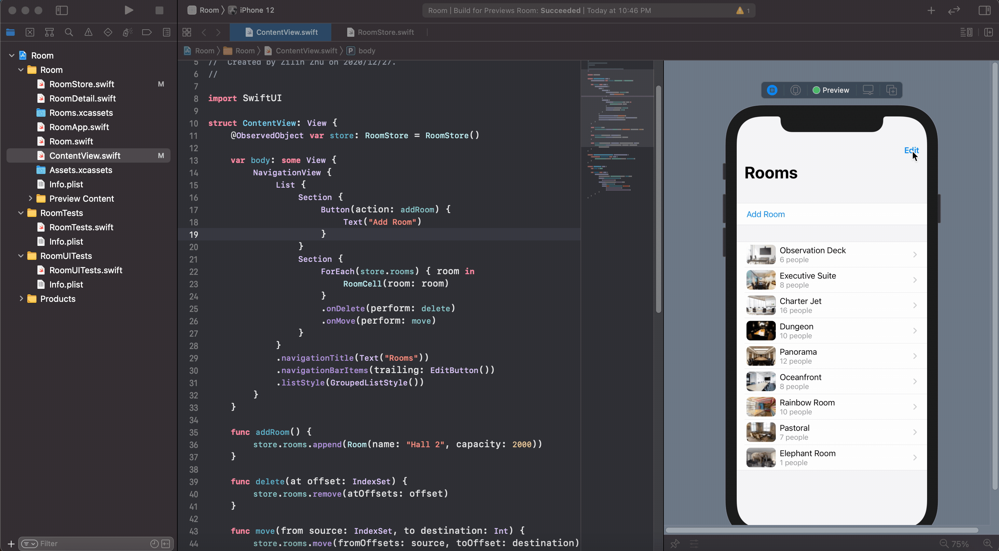

# 从wwdc2019学SwiftUI——搭建你的第一个 SwiftUI 应用 (4)

让我们继续跟着 wwdc2019 的 [Introducing SwiftUI: Building Your First App](https://developer.apple.com/videos/play/wwdc2019/204/) 来学习使用 SwiftUI。

## 下载项目

请通过下面的方法下载本篇教程的起始代码：

```bash
git clone https://github.com/swiftui-from-zero/wwdc2019_building_your_first_app.git
cd wwdc2019_building_your_first_app
git checkout before-mutable-list
```

并用 Xcode 打开 `wwdc2019_building_your_first_app/Room/Room.xcodeproj`。

依旧希望大家能跟着教程一起写代码，这样学习效率更高哦！

## 提取存储模型

这次的代码和 (3) 的结尾相比，主要是增加了 `RoomStore.swift` 这个文件，以及一些后面要用到的图片。

`RoomStore.swift` 中的代码非常简单，就是一个存储会议室数组的类：

```swift
import SwiftUI

class RoomStore {
    var rooms: [Room]
    
    init(rooms: [Room] = []) {
        self.rooms = rooms
    }
}
```

一般我们会在 UI 外面单独组织存储模型，把存储逻辑和 UI 逻辑相对分离，从而更好地开发应用。在这里，我们就是计划用 `RoomStore` 这个类来存储应用所需的数据，也就是会议室的列表。这个改变需要把 `ContentView` 中的 `[Room]` 参数改为 `RoomStore` 类型。改变后的代码变为：

```swift
struct ContentView: View {
    var store : RoomStore = RoomStore()  // 这里原来是 var rooms: [Room] = []

    var body: some View {
        NavigationView {
            List(store.rooms) { room in  // 这里要把 rooms 改为 store.rooms
                RoomCell(room: room)
            }
            .navigationTitle(Text("Rooms"))
        }
    }
}
```

对应的也需要把预览部分的初始化方式加以改变：

```swift
struct ContentView_Previews: PreviewProvider {
    static var previews: some View {
        ContentView(store: RoomStore(rooms: testData))
    }
}
```

## 增删会议室

现在我们的视图只能显示 `testData` 中预设的值，我们希望能对这些值进行增删。

首先是增，我们希望能点击一个按钮，添加一个能容纳 2000 人的大会议室 "Hall 2"。

先要做一些准备工作，我们需要在 `List` 中加一个按钮。这里就要提到 `List` 的一个特性了，它既可以动态生成列表，也就是把传入的数组中的每个元素都转化为一个格子，也可以生成静态列表，也就是直接把所有的格子给它，由他进行排布。为了添加这个按钮，我们需要把动态列表转为静态。也就是从：

```swift
List(store.rooms) { room in
    RoomCell(room: room)
}
```

转变为：

```swift
List {
    ForEach(store.rooms) { room in
        RoomCell(room: room)
    }
}
```

这个修改应该不会更改预览的样子。之后我们把按钮加上：

```swift
List {
    Button(action: {}) {
        Text("Add Room")
    }
    ForEach(store.rooms) { room in
        RoomCell(room: room)
    }
}
```



接下来，添加一个 `addRoom` 函数作为点击按钮的数据操作，为了简单起见，我们设置点击一下按钮就会添加 Hall 2 这个会议室。然后回忆起 (3) 中 `RoomDetail` 视图中的 `zoomed`，我们尝试在 `store` 参数前面加一个 `@State`。于是代码变成了：

```swift
struct ContentView: View {
    @State var store: RoomStore = RoomStore()

    var body: some View {
        NavigationView {
            List {
                Button(action: addRoom) {
                    Text("Add Room")
                }
                ...
            }
            ...
        }
    }
    
    func addRoom() {
        store.rooms.append(Room(name: "Hall 2", capacity: 2000))
    }
}
```

这个时候在预览中尝试点击按钮，却没有效果。为什么呢？这是因为我们的 `RoomStore` 是引用类型（`class`），而非值类型（`struct`）。SwiftUI 要求我们对值类型和引用类型采取不同的操作。如果在 `RoomStore.swift` 中，把 `class RoomStore` 改成 `struct RoomStore` 的话，按钮就变得有效了。

对于引用类型，我们需要修改 `RoomStore` 类，给他加上 `ObservableObject` 这个协议，并把需要视图关注的成员变量加上 `@Published` property wrapper，修改后的 `RoomStore` 变为：

```swift
class RoomStore: ObservableObject {
    @Published var rooms: [Room]
    
    init(rooms: [Room] = []) {
        self.rooms = rooms
    }
}
```

在 `ContentView` 中，在 `store` 前使用 `@ObservedObject` 而不是 `@State`。

```swift
struct ContentView: View {
    @ObservedObject var store: RoomStore = RoomStore()

    var body: some View {
        NavigationView {
            List {
                Button(action: addRoom) {
                    Text("Add Room")
                }
                ...
            }
            ...
        }
    }
    
    func addRoom() {
        store.rooms.append(Room(name: "Hall 2", capacity: 2000))
    }
}
```

进行了这样的调整之后，我们的按钮就能发挥作用了。



下一步，我们简单地更改了一下列表的样式，把 Add Room 按钮和下面陈列的会议室分开为两部分。这里要用一下 `.listStyle` 这个 modifier。它会根据我们划分的 `Section` 把列表分组进行展示。修改后的 `List` 如下：

```swift
List {
    // 这里分了 2 个 Section
    Section {
        Button(action: addRoom) {
            Text("Add Room")
        }
    }
    Section {
        ForEach(store.rooms) { room in
            RoomCell(room: room)
        }
    }
}
.navigationTitle(Text("Rooms"))
.listStyle(GroupedListStyle())
```

可以看到预览中的列表已经对应着进行了变化。



接下来，我们来加入删除操作。删除操作格外简单，控制生成列表单元的 `ForEach` 上使用 `onDelete` 这个 modifier 就好了。当然，我们还需要给 `onDelete` 提供一个回调函数。在 `ContentView` 中写一个 `delete` 函数，通过 `IndexSet` 删除 `store.rooms` 中对应的会议室，并把这个函数传给 `onDelete` 就行了。修改后的 `ContentView` 的代码如下：

```swift
struct ContentView: View {
    ...

    var body: some View {
        NavigationView {
            List {
                ...
                Section {
                    ForEach(store.rooms) { room in
                        RoomCell(room: room)
                    }
                    .onDelete(perform: delete)
                }
            }
            ...
        }
    }

    ...

    func delete(at offset: IndexSet) {
        store.rooms.remove(atOffsets: offset)
    }
}
```

修改代码后，运行预览就会发现，SwiftUI 自动生成了删除相关的动画。在需要删除的会议室格子上左滑，就就会出现 iOS 惯例的红色的删除按钮，点击就可以删除了。



至此，我们就完成了列表元素的插入与删除了。

## 添加编辑模式

除去上面的增删方式，应用中也经常有下图这样的使用方式：点击右上角的编辑按钮进入编辑模式，就可以对列表的元素进行重新排序或者删除操作，操作完成后，再次点击按钮就可以退出编辑模式，并保存过程中的改动。



没错，SwiftUI 让我们可以轻松的添加这样的功能。只需要在 `List` 后面加一个 `.navigationBarItems(trailing: EditButton())`，我们就得到了右上角的编辑按钮。对于拖拽排序功能，和上面的删除类似，给 `ForEach` 加上 `onMove`，并加上一个 `move` 函数就好了。修改后的代码如下：

```swift
struct ContentView: View {
    ...

    var body: some View {
        NavigationView {
            List {
                ...
                Section {
                    ForEach(store.rooms) { room in
                        RoomCell(room: room)
                    }
                    .onDelete(perform: delete)
                    .onMove(perform: move)
                }
            }
            ...
            .navigationBarItems(trailing: EditButton())
            ...
        }
    }
    
    ...
    
    func delete(at offset: IndexSet) {
        store.rooms.remove(atOffsets: offset)
    }
    
    func move(from source: IndexSet, to destination: Int) {
        store.rooms.move(fromOffsets: source, toOffset: destination)
    }
}
```

修改代码后运行预览，就可以得到上面动图中的效果了。

到这里我们就基本完成了这个会议室应用了。在下一篇教程中，我会介绍该如何更好地使用预览功能，去查看不同状态（如黑暗模式）下的样子。并且我们会介绍该如何使用本地化工具，让我们的程序可以更好地适应不同地区、不同语言的使用习惯。敬请期待！