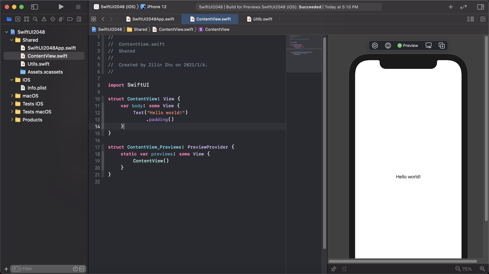
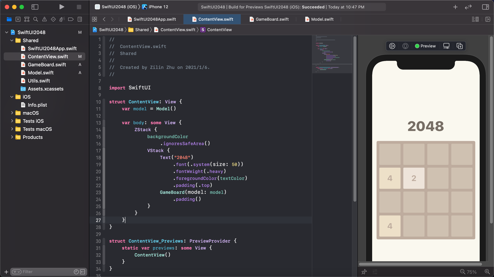

# 用 SwiftUI2.0 做个 2048 (1)——静态视图

2048 已经逐步变成了 UI 届的 "hello world"，所以让我们来用 SwiftUI 2.0 做一个 2048吧！在这个系列教程中，我们将一起写出一个同时支持 iOS 和 macOS 的 2048，最后的效果如下图：

<p align="center">
    
</p>

本系列教程需要 Xcode 12，macOS 11 以上，还没升级的小伙伴赶快升级呀~ 我们可能会忽略一些 SwiftUI 的基础知识，如果你是第一次接触 SwiftUI，希望你花些时间学习一下[从 wwdc 学 SwiftUI —— 搭建你的第一个 SwiftUI 应用](https://github.com/swiftui-from-zero/wwdc2019_building_your_first_app) 系列教程，相信在那里你会很快的对 SwiftUI 这个简单的 UI 框架有所了解。

好啦，废话不多说了，让我们开始吧！

## 准备初始代码

首先让我们下载初始的代码：

```bash
git clone https://github.com/swiftui-from-zero/2048.git
cd 2048
git checkout tutorial-1-startup
```

在项目目录中有一个我创建的名叫 `SwiftUI2048` 的项目。用 Xcode 打开项目后，就是我们熟悉的 Hello world 界面了。



为了在之后支持 macOS，这个项目是我基于 multiplatform app 的模板构建的，如果你想自己从零开始，可以在 Xcode 的选项中根据下图进行选择：

<p align="center">
    
</p>

除去基本模板生成的代码之外，我还加入了一个 `Utils.swift`，里面有一些预先设置的颜色，方便我们绘制 UI 的时候使用。

## 创建棋盘

从上面的成果图可以看出，我们的 UI 界面由 2 部分组成，上面是 2048 的文字标题，下面就是一个棋盘了。显然棋盘的部分更为复杂，所以让我们新建一个 `GameBoard.swift` 文件，主要负责棋盘的内容。因为我们希望在 iOS 和 macOS版本的游戏中使用同样的视图，所以注意在新建的时候选择创建在 Shared 文件夹中。

<p align="center">
    
</p>

不用多说，我们的棋盘是一个圆角正方形，这里我们设置圆角半径为 5，颜色则选择 `Utils.swift` 中的 `secondBackgroundColor`。修改后的 `GameBoard` 视图变为：

```swift
struct GameBoard: View {
    var body: some View {
        RoundedRectangle(cornerRadius: 5)
            .fill(secondBackgroundColor)
            .aspectRatio(1.0, contentMode: .fit)
    }
}
```


### 用 GeometryReader 创建棋格

回去观察 2048 的界面，我们会发现除去上面移动的彩色滑块，在棋盘的空格处也是会显示不同颜色的格子的，我们下一步就来把它们画上去。

棋格应该将棋盘均匀地划分为 4x4，但是棋盘的边长并不是固定值，该如何动态获取棋盘的大小呢？这是我们就要用到 `GeometryReader` 这个视图了。`GeometryReader` 可以获取他自己所占据的空间的大小以及相对位置，在它的帮助下我们就可以计算棋格的边长和坐标了。为了让代码的结构更清晰，我们把棋格的部分单独提取成一个计算属性 `content`

```swift
struct GameBoard: View {
    ...
    var content: some View {
        GeometryReader { geometry in
            
        }
    }
}
```

 `GeometryReader` 会为我们提供一个 `GeometryProxy` 类型的参数（也就是我上面代码里的 `geometry`）变量。用 `geometry.size` 就可以获得它所占据的空间的大小了。这里我们就剩下 2 个问题：

- 如何用 `geometry.size` 绘制棋格？
- 怎样保证 `GeometryReader` 占据的空间和棋盘相同？

我们先来解决第一个问题。因为这里我们只需要 `geometry.size`，为了不重复，所以我们在 `blackBoard` 函数中生成棋格：

```swift
struct GameBoard: View {
    ...
    var content: some View {
        GeometryReader { geometry in
            blankBoard(for: geometry.size)
        }
    }
		// 空棋盘对应的所有格子
    func blankBoard(for size: CGSize) -> some View {
        ForEach(0..<4) { x in
            ForEach(0..<4) { y in
                RoundedRectangle(cornerRadius: 3)
                    .fill(blankColor)
                     // 主要要先做 padding，让 padding 的空间也算在格子的空间内
                    .padding(5)
                     // 边长为 1/4
                    .frame(width: size.width / 4,
                           height: size.height / 4)
                     // 移动到 (x/4, y/4) 的位置
                    .offset(x: CGFloat(x) * size.width / 4,
                              y: CGFloat(y) * size.height / 4)
            }
        }
    }
}
```

上面的函数应该很清晰，4x4 的格子，每个格子都是一个圆角正方形，用 `.frame` 保证其边长为棋盘的 1/4（注意需要在 `.frame` 前面用 `.padding` modifier，这样就会把 padding 的部分也算到棋盘占的空间里），用 `.offset` 把格子移动到他们对应的坐标上。

有了空棋盘之后，我们来解决第二个问题，如何让 `GeometryReader` 占据的空间和棋盘相同。

因为格子需要花在棋盘上，所以有的同学可能想到用 `ZStack` 来堆叠。但是因为 `ZStack` 的可用空间为整个屏幕，所以会造成下图的效果：


`ZStack` 看来是不行了...那么有什么别的法子吗？实际上，有一个很方便的 modifier 可以帮我们完成这个功能，那就是 `.overlay`。`.overlay` 会在被施加的视图上绘制新视图，如果把我们的 `content` 画在棋盘上，就会得到正确的效果了：

```swift
    var body: some View {
        RoundedRectangle(cornerRadius: 5)
            .fill(secondBackgroundColor)
            .aspectRatio(1.0, contentMode: .fit)
            .overlay(content)  // 好用的 .overlay
    }
```


注意上图中，因为外边沿太窄了，我在 `content` 里面也加了 `.padding(5)`。

### 创建滑块

下面的棋盘已经做好了，我们要开始考虑上面的滑块怎么做了。首先我们要为这些滑块的状态搭建一个模型，其次是根据模型把它们叠加在棋盘上。

#### 搭建模型

为了更好地维护代码，一般需要把模型的部分和视图的部分分开。所以让我们为模型单独创建一个 `Model.swift`，注意因为这个文件不需要生成 UI，在新建时选择 Swift File，而不要选择 SwiftUI View。

我们的模型要由滑块组成，所以先来创建一个滑块的结构体：

```swift
struct Block {
    var pos: Int  // 0~15 的整数
    var val: Int
    
    var x: Int {
        pos / 4
    }
    
    var y: Int {
        pos % 4
    }
}
```

滑块的结构很简单，里面记录了当前的位置和数值。

我们的模型显然是要由一系列滑块组成的，所以让我们创建一个 `Model` 类，其包含一个 `Block` 类型的数组：

```swift
class Model: ObservableObject {
    var blocks: [Block]
}
```

这里注意，因为我们的整个游戏需要共享同一个模型，所以在创建 `Model` 时，要使用引用类型的类（`class`），而不是值类型的结构体（`struct`）。也是因为这样，所以我们需要给他一个构造函数。玩过 2048 游戏的朋友应该知道，游戏初始化的时候会随机的创建几个滑块，所以让我们来创建一个随机生成滑块的函数 `rand`，并在构造函数里调用 3 次让我们的模型在新游戏时随机有 3 个滑块。

```swift
class Model: ObservableObject {
    var blocks: [Block]
    
    init() {
        blocks = []
        for _ in 0..<3 {
            rand()
        }
    }
    
    func rand() {}
}
```

`rand` 的逻辑有很多不同的实现方法，不过因为我们最多只有 16 个滑块，所以我们可以选用最笨也是最好理解的方法：对于每个位置，循环查看是不是已经被滑块占了，没有的话就记录在一个空位置的数组里，然后在这个数组里随机选一个位置作为生成的滑块的位置。

```swift
    func rand() {
        var emptyPos: [Int] = []
        for pos in 0..<16 {
            var empty = true
            for block in blocks {
                if block.pos == pos {
                    empty = false
                    break
                }
            }
            if empty {
                emptyPos.append(pos)
            }
        }
				// 如果都占满了，也就不需要在生成了
        guard emptyPos.count != 0 else {
            return
        }

        let randPos: Int = emptyPos[Int.random(in: 0..<emptyPos.count)]
        // 对于新滑块，我们让他有 50% 的可能是 2，50% 的可能是 4
        blocks.append(Block(pos: randPos, val: Bool.random() ? 2 : 4))
    }
```

到这里我们就完成了最基础的模型了。

#### 根据模型绘制滑块

有了模型，我们就可以开始绘制滑块了。回到 `GameBoard.swift`，首先要在 `GameBoard` 视图里加一个 `Model` 类型的成员变量：

```swift
struct GameBoard: View {
    var model: Model

    ...
}

struct GameBoard_Previews: PreviewProvider {
    static var previews: some View {
      	// 注意也要更新预览视图
        GameBoard(model: Model())
    }
}
```

然后我们可以模仿上面的棋格，类似地创建一个 `numberBoard` 函数：

```swift
struct GameBoard: View {
    ...
    var content: some View {
        GeometryReader { geometry in
            blankBoard(for: geometry.size)
            numberBoard(for: geometry.size)
        }
        .padding(5)
    }
    ...
    func numberBoard(for size: CGSize) -> some View {
        ForEach(model.blocks) { block in
            RoundedRectangle(cornerRadius: 3)
                // 根据数据选择颜色
                .fill(colorPalette[block.val]!)
                .padding(5)
                .frame(width: size.width / 4,
                       height: size.height / 4)
                .offset(x: CGFloat(block.x) * size.width / 4,
                        y: CGFloat(block.y) * size.height / 4)
        }
    }
}
```

这里我们用 `ForEach` 来循环创建每个滑块。和棋格一样，滑块也是一个圆角正方形，只不过颜色需要根据存储的数据做变化。这里因为我们的 `ForEach` 循环了 `Block` 数组，所以需要 `Block` 结构符合 `Identifiable` 协议，也需要我们给 `Block` 加个 `id`：

```swift
struct Block: Identifiable {
    var id: UUID = UUID()
    ...
}
```

修改完后，回到 `GameBoard.swift`，点击预览中的 resume，应该就可以看到下图的效果了：


诶，是不是少了什么？对了，滑块上还应该有标记的数字呢。不过在添加数字之前，我们的 `GameBoard` 视图已经很复杂了，让我们来清理一下，把每个棋格或者滑块作为 `BlankBlock` 和 `NumberBlock` 子视图分别提取出去。

```swift
// 棋格
struct BlankBlock: View {
    var width: CGFloat
    var height: CGFloat
    
    var body: some View {
        RoundedRectangle(cornerRadius: 3)
            .fill(blankColor)
            .padding(5)
            .frame(width: width, height: height)
    }
}
// 滑块
struct NumberBlock: View {
    var width: CGFloat
    var height: CGFloat
    var val: Int

    var body: some View {
        RoundedRectangle(cornerRadius: 3)
            .fill(colorPalette[val]!)
            .padding(5)
            .frame(width: width, height: height)
    }
}

struct GameBoard: View {
    ...
    func blankBoard(for size: CGSize) -> some View {
        ForEach(0..<4) { x in
            ForEach(0..<4) { y in
                BlankBlock(width: size.width / 4,
                          height: size.height / 4)
                    .offset(x: CGFloat(x) * size.width / 4,
                           y: CGFloat(y) * size.height / 4)
            }
        }
    }

    func numberBoard(for size: CGSize) -> some View {
        ForEach(model.blocks) { block in
            NumberBlock(width: size.width / 4,
                       height: size.height / 4,
                       val: block.val)
                .offset(x: CGFloat(block.x) * size.width / 4,
                       y: CGFloat(block.y) * size.height / 4)
        }
    }
}
```

把这两个视图提取出去之后，添加数字自然就只用修改 `NumberBlock` 了。该如何在滑块上创建数字呢？没错，我们还可以用 `.overlay`：

```swift
struct NumberBlock: View {
    ...
    var body: some View {
        RoundedRectangle(cornerRadius: 3)
            .fill(colorPalette[val]!)
            .padding(5)
            .frame(width: width, height: height)
            // 这里有一个小技巧，如果直接用 "\(val)" 的话，
            // 4 位及以上数字中会有逗号，不够美观
            .overlay(Text("\(String(val))")
                        // 3 位以内的字号可以更大一些
                        .font(val < 1024 ?
                                .system(size: width / 3) :
                                .system(size: width / 4))
                        .fontWeight(.bold)
                        // 8 及以上的背景颜色较深，数字一般用白色
                        .foregroundColor(val >= 8 ?
                                        Color.white :
                                        secondBackgroundColor))
    }
}
```


这样我们的视图是不是就正确多了呢？

#### 测试绘制结果

我们为不同范围的数字提供了不同的滑块样式，可现在的只能随机生成 2 和 4，该怎样确保在大数范围内我们的设计是正确的呢？回忆一下，现在的 3 个随机滑块是哪儿来的，我们可以让模型提供一种用于测试的初始化方法。这里我们修改 `Model` 的 `init` 函数为：

```swift
    init(numBlocks: [[Int]] = []) {
        blocks = []
        if numBlocks != [] {
            for y in 0..<4 {
                for x in 0..<4 {
                    if numBlocks[y][x] > 0 {
                        blocks.append(Block(pos: x * 4 + y, val: numBlocks[y][x]))
                    }
                }
            }
        } else {
            for _ in 0..<3 {
                rand()
            }
        }
    }
```

这样我们就可以通过传递一个 4x4 的二维整数数组来任意初始化模型，从而测试模型的状态了。我们可以把 `GameBoard` 的预览视图改为：

```swift
struct GameBoard_Previews: PreviewProvider {
    static var previews: some View {
        GameBoard(model: Model(numBlocks:
                                [[0, 2, 4, 8],
                                 [16, 32, 64, 128],
                                 [256, 512, 1024, 2048],
                                 [4096, 8192, 16384, 32768]]))
    }
}
```

从而让预览变为：


就可以看到所有数值下的情况了。在做这部修改的时候如果预览报错，可能是预览没有察觉到 `Model.swift` 中的改动。可以考虑点击屏幕左上的三角按钮编译并运行应用，然后回到右侧的预览，点击 Try again 进行重试。

到这里我们就完成了棋盘部分的绘制了。看到最后测试部分的同学可能会有这样的疑问：为什么我们的 `Model` 类型要存储一个`[Block]`而不是直接保存`[[Int]]`呢？这个设计和我们后面用到的 SwiftUI 的动画相关，我们先卖个关子，后续再讲。

## 完成主视图

完成了棋盘，我们就可以回到 `ContentView.swift` 文件，把我们做好的 `GameBoard` 放入 `ContentView` 中了。很容易想到，我们用一个 `VStack` 来累放标题和棋盘：

```swift
struct ContentView: View {
    // 别忘了要创建一个 Model 给棋盘用
    var model = Model()
    
    var body: some View {
        VStack {
            Text("2048")
                .font(.system(size: 50))
                .fontWeight(.heavy)
                .foregroundColor(textColor)
                .padding(.top)
            GameBoard(model: model)
                .padding()
        }
    }
}
```


然后利用 `ZStack` 来加上背景颜色（注意别忘了用 `.ignoresSafeArea`，不然刘海左右就不会上色了）：

```swift
struct ContentView: View {
    ...
    var body: some View {
        ZStack {
            backgroundColor
                .ignoresSafeArea()
            VStack {
                ...
            }
        }
    }
}
```



至此，我们的 2048 的静态视图就画好了，是不是还挺简单的呢？我们的这篇教程到这里也该结束了，在下一篇中，我们会添加手势，以及加入 2048 模型的滑动逻辑，敬请期待！
