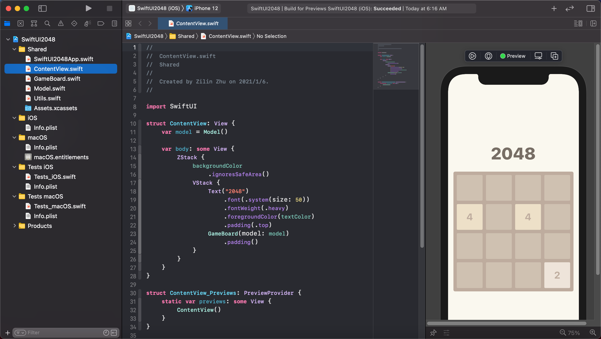
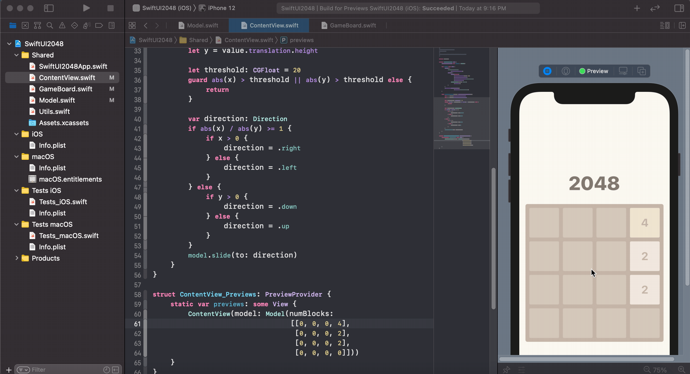

# 用 SwiftUI2.0 做个 2048 (2)——滑动逻辑和手势

> 2048 已经逐步变成了 UI 届的 "hello world"，所以让我们来用 SwiftUI 2.0 做一个 2048吧！在这个系列教程中，我们将一起写出一个同时支持 iOS 和 macOS 的 2048，最后的效果如下图：
>
> <p align="center">
>     
> </p>

## 准备初始代码

我们会沿用第一讲结尾的代码。没有看过第一讲的小伙伴请看[这里](https://github.com/swiftui-from-zero/posts/blob/main/4_%E7%94%A8SwiftUI2.0%E5%81%9A%E4%B8%AA2048-(1)%E2%80%94%E2%80%94%E9%9D%99%E6%80%81%E8%A7%86%E5%9B%BE.md)，如果想直接从这里开始的话，也可以下载我们的项目，并切换至 `tutorial-2-startup` 分支：

```bash
git clone https://github.com/swiftui-from-zero/2048.git
cd 2048
git checkout tutorial-2-startup
```

不管你是通过哪种方式获取代码的，打开项目后，都应该可以在 `ContentView` 的预览中看到类似下图的状态：



还是要提醒大家，跟着教程一起写代码，效果更好哦~

## 基本滑动逻辑

在上一讲中，我们顺利制作了静态的视图，虽然看上去像是那么回事儿了，但是不能动，有点愁人。要让游戏动起来，首先要让 `Model` 支持滑动，也就是给它加一个 `slide` 函数。

### 添加 `slide` 函数

先来做些准备，打开 `Model.swift`，添加一个表示方向的 `enum`：

```swift
enum Direction {
    case left
    case right
    case up
    case down

    var dx: Int {
        switch self {
            case .left: return -1
            case .right: return 1
            case .up: return 0
            case .down: return 0
        }
    }
    
    var dy: Int {
        switch self {
            case .left: return 0
            case .right: return 0
            case .up: return -1
            case .down: return 1
        }
    }
}
```

这里我们给 `Direction` 枚举加了 `dx` 和 `dy` 这样的两个计算属性，方便我们根据移动方向调整滑块。

有了表示方向的方式，就可以给 `Model` 类加上 `slide` 函数了。

```swift
class Model
    ...
    func slide(to direction: Direction) {}
}
```

`slide` 内部的逻辑该怎么实现呢？先来整理一下滑块移动的逻辑：

1. 只要在滑动方向前的格子是空的，滑块就会持续向前移动；

2. 如果滑动方向前的格子中有滑块，且滑块上的数字和要移动的滑块数字一样，那么两者就会融合成一个滑块，且数字乘2；
3. 其他情况下，滑块就不会移动

有了这个逻辑，我们来试着写一个效率可能不太高但是很好理解的算法。

上面的这3条逻辑中，其实比较麻烦的是第一条中的“只要”，这意味我们很难在移动开始的时候就知道一个滑块最终的位置，所以不妨写一个循环，每次只允许一个滑块移动一格，如果有哪一次没有任何滑块移动了，就说明已经达成了这次滑动的最终状态，可以退出循环了。用代码来呈现的话大致是这样：

```swift
    func slide(to direction: Direction) {
        var moved: Bool = true
        while moved {
            moved = false
            for i in 0..<blocks.count {
                if moveBlock(i: i, to: direction) {
                    moved = true
                    break
                }
            }
        }
    }
```

搭上了这个架子，我们就要只需要实现 `moveBlock`（让滑块 `i` 试着向 `direction` 移动一格）这样的一个比较简单的函数，也就把上面的 3 条逻辑化简为了：

```
func moveBlock:
    if 前面是空的 then 移动
    else if 前面非空，数字相同 then 融合
    else then 不动
```

对照着这样的伪代码，我们就可以写出来 `moveBlock` 了，函数的返回值是滑块是否发生了变化（融合或移动）：

```swift
class Model {
    ...
    func moveBlock(i: Int, to direction: Direction) -> Bool {
        let new_x = blocks[i].x + direction.dx
        let new_y = blocks[i].y + direction.dy
        // 如果已经到了棋格边沿了，继续移动就要掉出去了
        guard 0 <= new_x && new_x < 4 && 0 <= new_y && new_y < 4 else {
            return false
        }

        let new_pos = new_x * 4 + new_y

        for j in 0..<blocks.count {
            if new_pos == blocks[j].pos {
                if blocks[i].val == blocks[j].val {
                    // 数字相同，需要融合
                    blocks[j].val *= 2
                    blocks.remove(at: i)
                    return true
                } else {
                    // 不动
                    return false
                }
            }
        }
        // 前面为空，移动
        blocks[i].pos = new_pos
        return true
    }
}
```

## 添加手势

实现了基本的滑动逻辑后，让我们尽快添加手势来进行互动和验证。

### 让视图可以追踪模型变化

现在我们的视图还不能随着模型的变化而变化，所以让我们把 SwiftUI 提供的响应式工具加进来，也就是让 `Model` 符合 `ObservableObject` 协议，并给 `blocks` 这个变量添加上 `@Published`：

```swift
class Model: ObservableObject {
    @Published var blocks: [Block]
    ...
}
```

在给 `ContentView` 和 `GameBoard` 里的 `model` 加上 `@ObservedObject`：

```swift
// ContentView.swift
struct ContentView: View {
    @ObservedObject var model = Model()
    ...
}

// GameBoard.swift
struct GameBoard: View {
    @ObservedObject var model: Model
    ...
}
```

注意，因为我们的 `Model` 是一个类（`class`），而不是一个结构体（`struct`），所以不能用 `@State` 修饰它。

### 用 `.gesture` modifier 绑定手势

SwiftUI 提供了一个很方便的 modifier——`.gesture`，可以用来绑定不同类型的手势。这里我们要注册的是滑动手势，所以使用 `DragGesture`：

```swift
struct ContentView: View {
    @ObservedObject var model = Model()
    
    var body: some View {
        ZStack {
            ...
        }
        .gesture(DragGesture()
                    .onEnded(dragGesture))
    }
}
```

里面我们绑定了一个 `dragGesture`，在滑动结束的时候会执行。在这个滑动函数里，我们要用 `DragGesture` 提供的拖拽位移来确定滑块们要往那个方向移动：

```swift
class ContentView {
    ...
    func dragGesture(value: DragGesture.Value) {
        let x = value.translation.width
        let y = value.translation.height
        // 忽略误触
        let threshold: CGFloat = 20
        guard abs(x) > threshold || abs(y) > threshold else {
            return
        }
        
        var direction: Direction
        if abs(x) / abs(y) >= 1 {
            if x > 0 {
                direction = .right
            } else {
                direction = .left
            }
        } else {
            if y > 0 {
                direction = .down
            } else {
                direction = .up
            }
        }
        model.slide(to: direction)
    }
}
```

打开预览，滑块们就可以随着手势移动了。


## 优化滑动逻辑

我们现在的这个简单的 `slide` 函数还是有很多考虑不足的地方，在这一节中，让我们逐步优化一下。

首先是一个功能上的遗漏。在 2048 中，如果在一次滑动手势后，有滑块移动（或融合）了，那么就会随机出现一个新的标记为 2 或 4 的滑块。我们可以复用之前写过的 `rand` 函数来实现这一功能：

```swift
    func slide(to direction: Direction) {
        // 添加一个 everMoved 来记录是否有滑块发生了移动
        var everMoved: Bool = false
        ...
        while moved {
            ...
            for i in 0..<blocks.count {
                if moveBlock(i: i, to: direction) {
                    ...
                    everMoved = true
                    break
                }
            }
        }
        // 如果有过移动，就随机生成一个滑块
        if everMoved {
            rand()
        }
    }
```

刷新预览，就可以看到下面的效果了：


出了上面的功能，还需要我们修复 2 个和融合相关的 bug。

首先是融合顺序，如下图：


第一行的 `| |2|2|2|` 在向右滑的时候并没有形成 `| | |2|4|`，而是 `| | |4|2|`。这是由于 `slide` 函数的模型中，我们先移动了第一行第二个滑块，而不是第一行第三个。解决这个问题的方法也很简单，我们只需要在进入循环之前对所有滑块，也就是 `blocks` 做个排序，从而让在向右滑的是先移动右边的，向左滑的时候先移动左边的。这里我采用了一个比较简洁的写法：

```swift
    func slide(to direction: Direction) {
        // 对 blocks 排序，来保证
        //      | |2|2|2| --向右--> | | |2|4| 而不是 | | |4|2|
        blocks.sort {
            ($0.x - $1.x) * direction.dx > 0 || ($0.y - $1.y) * direction.dy > 0
        }
        ...
    }
```

注意，因为在循环过程中同一行的所有滑块之间的相互顺序不会改变，所以不需要在循环中再次进行排序了。

修复后，就有了正确的效果（注意如果预览没有变化，可以通过编译一下项目来重置预览缓存）：


另外一个 bug 如下图：


这里 `| |2|2|4|` 在移动后本来应该停止在 `| | |4|4|`，但是却继续进行了融合，把 2 个 4 合成了 8。所以我们在 `Block` 里面标识一下它是不是这一次的循环中已经被融合过了，如果被融合过了就不能再对它进行操作了。

```swift
struct Block: Identifiable {
    ...
    var merged: Bool = false
    ...
}
```

并在 `slide` 以及 `moveBlock` 函数中，根据节点的融合状态做些变化：

```swift
    func slide(to direction: Direction) {
        // 循环开始前，所有滑块的 merged 状态均初始化为 false
        for i in 0..<blocks.count {
            blocks[i].merged = false
        }
        ...
    }

    func moveBlock(i: Int, to direction: Direction) -> Bool {
        // 如果滑块的 merged 为 true，就不能移动了，直接返回
        guard !blocks[i].merged else {
            return false
        }
        ...
        for j in 0..<blocks.count {
            if new_pos == blocks[j].pos {
                if blocks[i].val == blocks[j].val {
                    blocks[j].val *= 2
                    // 合并的滑块的 merged 设置为 false
                    blocks[j].merged = true
                    blocks.remove(at: i)
                    return true
                } else { ... }
            }
        }
        ...
    }
```

有同学可能会问了，像现在这样，在 `moveBlock` 中直接返回 `false`，融合后的滑块岂不是不能再移动到旁边的空格去了？实际上，因为我们在修复第一个 bug 的时候对 `blocks` 做过排序，永远会先移动更靠移动方向的那条边的滑块，所以进行融合后的节点的前面一定不再是空格了，这么说可能有点抽象，我们举个例子：

```bash
初始状态：| |2|2| |
进行一次向右的滑动
循环 1：| |2| |2|
循环 2：| | |2|2|
循环 3：| | | |4|
循环 4，无变化，退出循环
```

修改后，重载预览，就可以看到 bug 被修复了：



到这里我们就完成了 2048 游戏的基本滑动逻辑，也绑定上了手势，可以进行简单的游玩了：

<p align="center">
    
</p>

但是玩起来体验有点差，因为缺少了滑块移动和融合的动画。在下一讲中我们就会和你一起，给 2048 游戏添加上合适的动画，敬请期待！